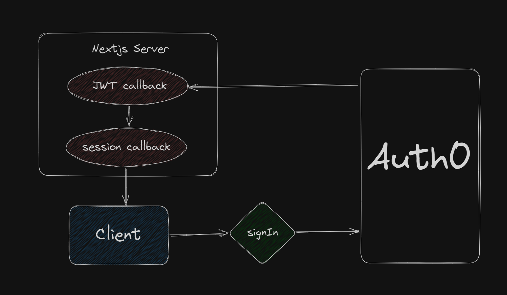

## Introduction

Today, we'll dive into NextAuth and understand how to leverage its power for client-side external API calls using JWT and Auth0. Let's get to it.

### Why NextAuth?

NextAuth provides a robust and easy-to-integrate authentication solution for Next.js apps. Forget the boilerplate code; it's just a few lines to set it up. It's the go-to choice for modern frontend developers.

### Initial Setup

First, install the necessary packages:

```bash
npm install next-auth
```
Add API route .../api/auth/[...nextauth].ts and insert the following:
```typescript
import NextAuth from "next-auth";
import Auth0Provider from "next-auth/providers/auth0";
import getConfig from "next/config";

const { serverRuntimeConfig } = getConfig();

export const authOptions: AuthOptions = {
  providers: [
    Auth0Provider({
      clientId:
        serverRuntimeConfig?.AUTH0_CLIENT_ID ??
        raise("no clientId env variable"),
      clientSecret:
        serverRuntimeConfig?.AUTH0_CLIENT_SECRET ??
        raise("no secret env variable"),
    }),
  ],
};

export default NextAuth(authOptions);
```
### Implementing Callbacks

Let’s add the jwt and session callbacks to store the access_token.

Update your .../api/auth/[...nextauth].ts:
```typescript
export const authOptions: AuthOptions = {
  providers: [
    Auth0Provider({
      ...id, and secret,
    }),
  ],
  callbacks: {
    async jwt({ token, account }) {
      if (account) {
        token = Object.assign({}, token, {
          access_token: account.access_token,
        });
      }
      return token;
    },
    async session({ session, token }) {
      if (session) {
        session = Object.assign({}, session, {
          access_token: token.access_token,
        });
      }
      return session;
    },
  },
};

export default NextAuth(authOptions);
```
Explanation:
jwt callback: Stores the access_token in the JWT token.
session callback: Appends access_token to the session.

Callback flow:


### Client-side 1/2: Store the JWT token on the client

Now on the client we are able to access the data via the session hook from next-auth

```jsx
// This could be done in a layout component or at the root of your project
import { useSession } from "next-auth/react";
import { useEffect } from "react";

export function Component(props: ComponentProps) {
    // Yes i was to lazy to add the correct typing
    const { data }: any = useSession();
    // I decided to put the token in the localStorage here
    useEffect(() => {
        const accessToken = localStorage.getItem("accessToken");
        if (!accessToken && data?.access_token) {
            localStorage.setItem("accessToken", data?.access_token);
        }
    }, [data]);
    return (
        <>
        ...
        </>
    )
}
```

### Client-side 2/2: Using Axios to Make API Calls

Install Axios:

```bash
npm install axios
```

Create an axios instance with the interceptor: 

```typescript
// /utils/axios-instance.ts
import axios from "axios";
import getConfig from "next/config";

const config = getConfig();
const axiosInstance = axios.create({
    // here you can also add the external api base url
  baseURL: config.publicRuntimeConfig.API_BASE_URL,
});

axiosInstance.interceptors.request.use(
  (config) => {
    const token = localStorage.getItem("accessToken");
    if (token) {
      config.headers["Authorization"] = `Bearer ${token}`;
    }
    return config;
  },
  (error) => {
    return Promise.reject(error);
  }
);

export default axiosInstance;
```

Now you can use your axiosInstance everywhere with the correct authentication for your external api:
```typescript
import axiosInstance from "@/utils/axios-instance";
import type { UserModel } from "@/types/api/user/user-model";
import { useQuery } from "react-query";

async function fetchUser(): Promise<UserModel> {
  return await axiosInstance
    .get("/api/v1/user/get")
    .then((response) => response.data);
}

export function useGetUser(enabled?: boolean) {
  return useQuery({
    queryKey: ["getUser"],
    queryFn: fetchUser,
    enabled: enabled,
  });
}
```

### Wrap Up

And boom! You've just implemented NextAuth in a Next.js app and understood the magic in session callbacks. It's not rocket science; it's just NextAuth doing its thing so you can do yours, securely and efficiently.